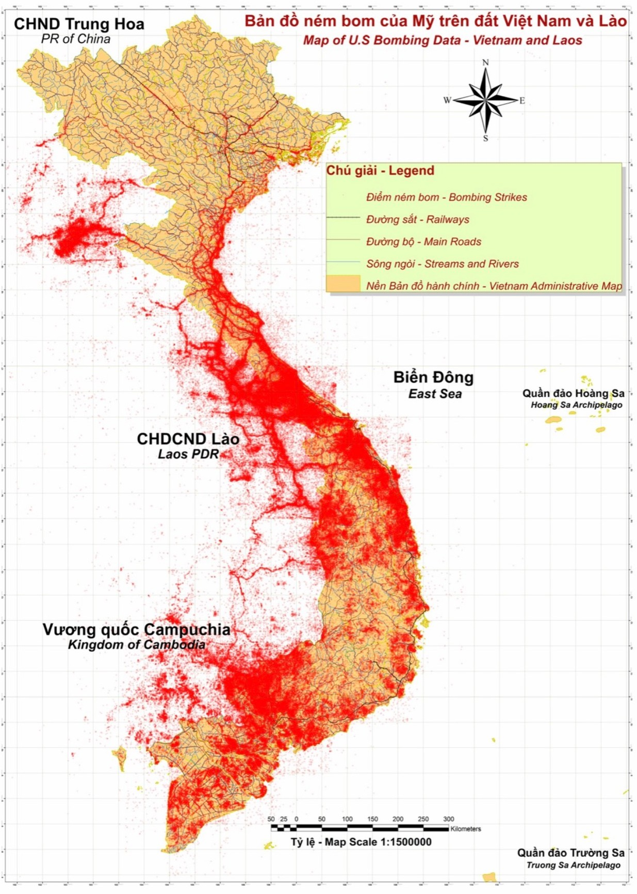
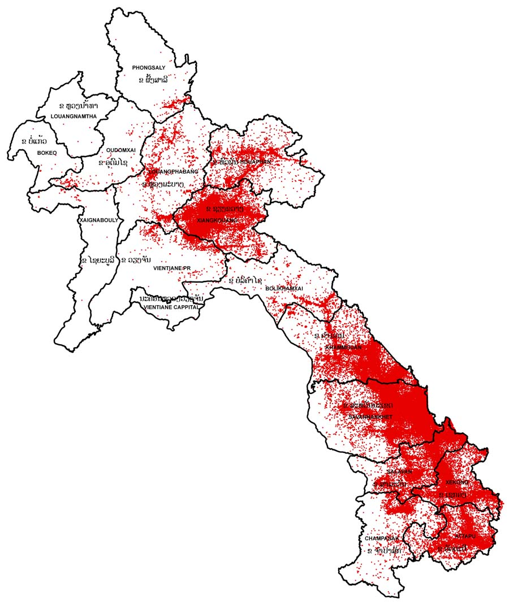

 <a href="https://sj-simmons.github.io/dl">The DL@DU Project</a> (<a href="https://www.github.com/sj-simmons/deep-learning#top">repo</a>) 

###  UXO in Laos

UXO stands for unexploded ordinance.

  

The map above shows bombing patterns in Vietnam spilling westward into Laos and
Cambodia. During the latter half of American involvement in war, when sorties
increasing originated in northern Thailand, vast tonnages of ordinance wound up
being dropped over Laos:

  

See the links below for details. For now, we collect a few notes:

* Over the roughly 20 period beginning in 1996, some 1.4 million UXO have
  been cleared from Laos -- a small fraction of the estimated total, of
  which 80 million (<-- verify this) remain.[1](#footnote1)

* A bomb that cost the United States 3 USD to manufacture and drop will cost Laos up to
  1000 USD to locate and destroy.[2](#footnote2)

It is this last figure (1000 USD) that warrants attacking. Can we use modern tools to aid
in locating UXO in Laos so that the process of removal is more cost-effective? If so, we
will help attack the other problematic figure, the 80 million.

* In Laos alone, an estimated 30,000 people were injured or killed between 1964 and 1973,
  the 9 year period representing direct American involvement in the Vietnam War. Some
  20,000 additional casualties in Laos (as of 2018) have occurred since 1973.[1](#footnote1)

* An estimated 40% of casualties casualties over the decade ending in 2018 were children.[4](#footnote4)

* Per capita, Lao is the most heavily bombed country in history. One quarter of villages
  and 83% of provinces suffer from UXO contamination.[4](#footnote4)

---
#### Background
* <a name="footnote1">1 [Ending the threat of UXO in Laos](http://copelaos.org/what-is-happening/unexploded-ordnance/ending-the-threat-of-cluster-bombs-and-uxo/) from the [Cope Center](http://copelaos.org/).
* From [Legacies of War](http://legaciesofwar.org/)
  * [Secret war on Laos](http://legaciesofwar.org/about-laos/secret-war-laos/)
  * [Cluster bomb fact sheet](http://legaciesofwar.org/resources/cluster-bomb-fact-sheet/)
* Mother Jones article on the [2.5 million tons of ordinance dropped on Laos](https://www.motherjones.com/politics/2014/03/laos-vietnam-war-us-bombing-uxo/)
* From the [Pulitzer Center](https://pulitzercenter.org/) series [Laos: Remnants of War](https://pulitzercenter.org/projects/laos-remnants-war):
  * <a name="footnote2">2</a> [How the US secret war in Laos is still happening today](https://pulitzercenter.org/reporting/how-us-secret-war-laos-still-happening-today)
* [Bombing Missions of the Vietnam War](https://www.esri.com/en-us/maps-we-love/gallery/vietnam-bombing) from [esri](https://www.esri.com/en-us/home):
  * direct link to the [map](https://webapps-cdn.esri.com/CDN/page-templates/products/map-cookbook/vietnam.html)

---
#### Additional historical information
* [CIA Air Operations in Laos, 1955-1974](https://www.cia.gov/library/center-for-the-study-of-intelligence/csi-publications/csi-studies/studies/winter99-00/art7.html?fbclid=IwAR1sADPMRS8dfel-x3TzpOdp0Ixn2oor5vDnTIlj_RedbcbHqJRZTmvYz4s)

---
#### Organizations

* [MAG](https://www.maginternational.org/what-we-do/where-we-work/laos/)
* [UXO Laos](https://www.uxolao.org/) the Lao National Unexploded Ordinance
  Program (centered in Vientiane)
  * The [UXO Center](https://www.luangprabang-laos.com/Visit-UXO-Laos-center) in
    Luang Prabang

---
#### Data

---
#### Potentially relevant research

* [Crater detection from commercial satellite imagery to estimate unexploded ordnance in Cambodian agricultural land](https://journals.plos.org/plosone/article?id=10.1371/journal.pone.0229826#sec003)
* [Research project: Machine Learning for Optimal Unexploded Ordnance Mitigation](https://www.southampton.ac.uk/oes/research/projects/machine-learning.page)
* [Learning Machine Identification of Ferromagnetic UXO Using Magnetometry](https://www.researchgate.net/publication/273501531_Learning_Machine_Identification_of_Ferromagnetic_UXO_Using_Magnetometry) ([local pdf](lit/LearningMachineID.pdf))
* [Comparison of supervised and unsupervised machine learning techniques for UXO classification using EMI data](https://ui.adsabs.harvard.edu/abs/2011SPIE.8017E..06B/abstract)
* [GPR Signal Characterization for Automated Landmine and UXO Detection Based on Machine Learning Techniques](https://www.mdpi.com/2072-4292/6/10/9729)
* [Machine Learning Approach for Target Selection and Threat Classification of Wide Area Survey Data](https://www.serdp-estcp.org/Program-Areas/Munitions-Response/Land/Modeling-and-Signal-Processing/MR-1570)
* [Machine learning as supporting method for UXO mapping and detection](https://meetingorganizer.copernicus.org/EGU2020/EGU2020-22594.html?pdf) (abstract)

---
#### Current information surrounding demining in Laos

According to the Laotian Times:[5](#footnote5)

* During 2020, the NRA ([Laos National Regulatory Authority](http://www.nra.gov.la/)) plans to remediate
  munitions from a total of 10,000 hectares of land distributed
  among 1,106 villages in Laos.
* As of early 2020, CHAs (Confirmed Hazardous Areas, where UXO is evident)
  comprised a total area of over 111,000 hectares, about 60,000 hectares
  of which had been previously cleared.
* An estimated 87,000 hectares, in total, of contaminated land
  remain. <- needs clarification; does this mean, then, that
  an estimated 46K = 87K - (111K - 60K) hectares worth of CHAs have
  yet to be identified; or is it 87K hectares more CHA that is expected but not
  yet found.

From the [Lao PDR page](http://www.mineactionreview.org/country/lao-peoples-democratic-republic)
at [Mine Action Review](http://www.mineactionreview.org):
* Laos is listed as the *worst hit* in the category of *cluster munition*, followed by Vietnam
  and Cambodia; while Cambodia is the third *worst hit* country under *mines*.
* Mine Action Review's [2018 report](http://www.mineactionreview.org/assets/downloads/Clearing_Cluster_Munition_Remnants_2018_Lao_PDR.pdf) and [2019 report](http://www.mineactionreview.org/assets/downloads/Lao_PDR_Clearing_Cluster_Munition_Remnants_2019-62-77.pdf).

---
#### Additional footnotes

<a name="footnote3">3</a> [National Regulatory Authority for UXO/Mine Action Sector in Lao PDR](http://www.nra.gov.la/resources.html)  
<a name="footnote4">4</a> [2018 report (English)](http://www.nra.gov.la/resources/Annual%20Reports/Annual%20Report%20English/UXO%20Sector%20Annual%20Report%202018_English.pdf) from the National Regulatory Authority  
<a name="footnote5">5</a> Laotian Times [article](https://laotiantimes.com/2020/02/27/laos-to-clear-10000-hectares-of-uxo-in-2020/) (2/27/20)  
<a name="footnote6">6</a> [NRA presentation](http://veconac.org/uploads/files/18th%20General%20Assembly%20/VECONAC_18th_GA_National_Regulatory_Authority__NRA__Presentation_pdf.pdf) (Dec., 2018) ([local](lit/NRAPresentation.pdf))  
<a name="footnote7">7</a> [UXOLaos presentation](https://2018workshop.aseanmineaction.org/presentations/08-1_Wanthong-Khamdala_Lao-PDR_Land-Release.pdf) (Nov., 2018) ([local](lit/UXOLaosPresentation.pdf))

